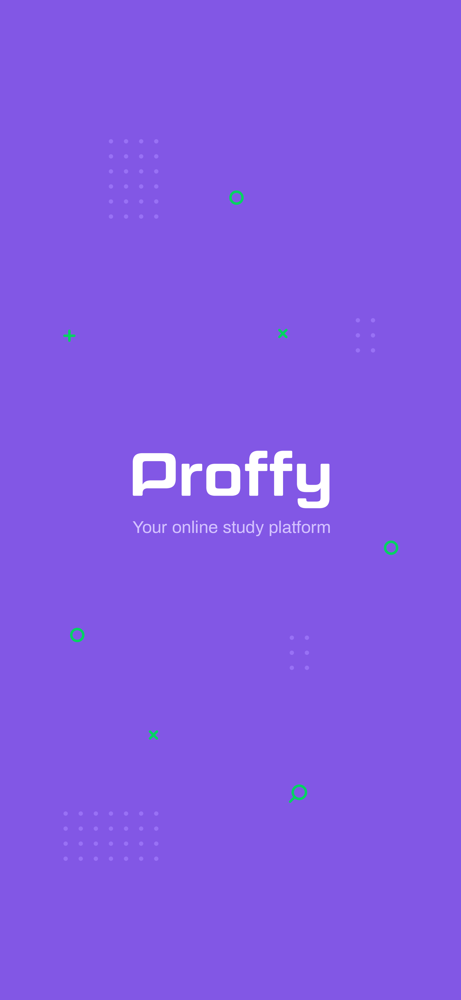

# Proffy 2.0

    

## Some technologies used in this project
<ul>
    <li>
        

            React Native
            
        

    </li>
    <li>
        

            Expo 
            
        

    </li> 
    <li>
        

        Reanimated 2 
            
        

    </li> 
    <li>
        

            Shopify's Restyle 
            
        

    </li> 
    <li>
        

            React Hook Form 
            
        

    </li> 
<ul>